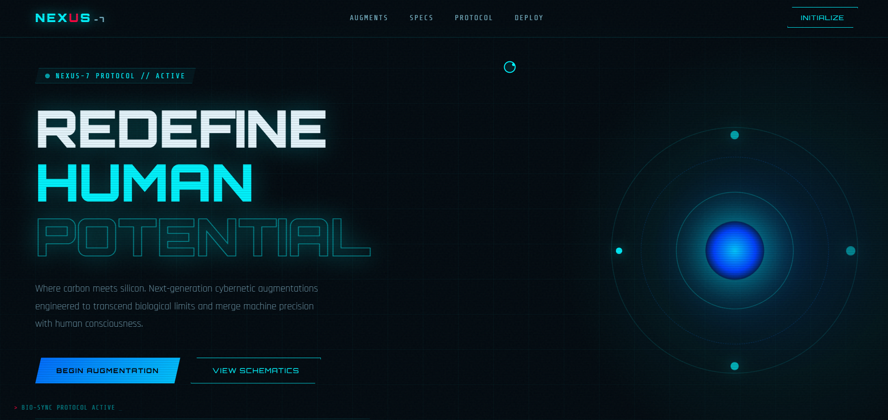

# 🤖 NEXUS-7 — Cyborg-Themed Landing Page

<div align="center">



> *"Where carbon meets silicon — redefine human potential."*

</div>

---

## 📌 Project Overview

**NEXUS-7** is a fully responsive, dark-themed cyberpunk/cyborg landing page built with **pure HTML5, CSS3, and Vanilla JavaScript** — zero external libraries or frameworks. It showcases advanced frontend UI/UX design techniques including animated elements, custom cursor, glitch effects, scroll-triggered animations, and a futuristic visual design system.

This project demonstrates real-world frontend skills: component architecture, CSS design tokens, scroll-driven interactions, and responsive layout engineering.

---

## 🖥️ Live Preview

> Open `cyborg-landing.html` directly in any modern browser — no server required.

```bash
# Clone and open instantly
git clone https://github.com/yourusername/nexus7-landing.git
cd nexus7-landing
open cyborg-landing.html        # macOS
start cyborg-landing.html       # Windows
xdg-open cyborg-landing.html    # Linux
```

---

## ✨ Features

### 🎨 UI / Visual Design
| Feature | Description |
|---|---|
| **Custom Cursor** | Smooth lagging follower dot — desktop only |
| **Glitch Text Effect** | CSS `::before / ::after` with clip-path animation |
| **Scanline Overlay** | CRT-style fixed scanlines via `repeating-linear-gradient` |
| **Noise Texture** | SVG `feTurbulence` embedded as background noise |
| **Cyborg Ring Visual** | Concentric rotating rings with animated core pulse |
| **Animated Marquee** | Infinite horizontal ticker tape strip |
| **Clip-path Geometry** | Hexagonal angled cards & buttons throughout |

### ⚙️ Interactions & Animations
| Feature | Description |
|---|---|
| **Hero Parallax** | Grid background scrolls at 30% speed |
| **Counter Animation** | Numbers count up on scroll into view |
| **Spec Bar Reveal** | Progress bars animate from 0% on scroll trigger |
| **Timeline Reveal** | Staggered `translateX` entrance per item |
| **Terminal Ticker** | Typewriter + erase loop in fixed bottom-left corner |
| **Reduced Motion** | Parallax skips if `prefers-reduced-motion` is set |

### 📱 Responsive Design (Breakpoints)
| Breakpoint | Layout Change |
|---|---|
| `≤ 1280px` | Ring visual scales down |
| `≤ 1100px` | Ring visual hidden, hero goes full-width |
| `≤ 768px` | Hamburger menu appears, single column layout |
| `≤ 480px` | Typography scales, buttons stack |
| `≤ 360px` | Ultra-compact layout, full-width buttons |

---

## 📁 Project Structure

```
nexus7-landing/
│
├── cyborg-landing.html        # Main file — all HTML + CSS + JS in one file
├── README.md                  # Project documentation
│
└── assets/                    # (Optional) if you extract resources
    ├── fonts/                 # Google Fonts (loaded via CDN)
    └── screenshots/           # Preview images for README
```

> **Single-file architecture** — the entire project is self-contained in one HTML file for maximum portability.

---

## 🛠️ Tech Stack

```
Frontend Layer
├── HTML5              — Semantic structure & accessibility
├── CSS3               — Animations, Grid, Flexbox, clip-path, custom properties
│   ├── CSS Variables  — Full design token system (--cyan, --red, --glow...)
│   ├── @keyframes     — 12+ custom animations
│   ├── @media queries — 5 responsive breakpoints
│   └── @media hover   — Touch-device hover guard
└── Vanilla JavaScript — DOM, scroll events, RAF animation loop
    ├── Custom Cursor  — requestAnimationFrame lerp smoothing
    ├── Hamburger Menu — Toggle + body scroll lock
    ├── Ticker         — Async typewriter state machine
    └── Scroll Hooks   — IntersectionObserver-style manual checks
```

---

## 🧩 Sections Breakdown

```
NEXUS-7 Landing Page
│
├── 🔵 Navbar          — Fixed, glassmorphism, hamburger on mobile
├── 🚀 Hero            — Glitch title, stats counter, rotating ring visual
├── 📡 Marquee         — Infinite scrolling tech keywords strip
├── ⬡  Augmentations   — 6-card grid with hover accent effects
├── 📊 Specifications  — Animated progress bars + detail cards
├── 🕒 Timeline        — 4-phase protocol with scroll reveal
├── 📣 CTA             — Call-to-action with radial glow bg
└── 🦶 Footer          — Logo + copyright + classification tag
```

---

## 🎨 Design System

### Color Palette
```css
--cyan:   #00f5ff   /* Primary accent — interfaces, glows, highlights */
--blue:   #0080ff   /* Secondary accent — gradients, rings             */
--red:    #ff003c   /* Danger / logo accent                            */
--dark:   #020a10   /* Page background                                 */
--darker: #010508   /* Section background (alternating)                */
--mid:    #071520   /* Card backgrounds                                */
```

### Typography
```
Orbitron       — Headers, logo, buttons (futuristic geometric)
Share Tech Mono — Labels, tags, ticker (monospace terminal feel)
Rajdhani       — Body text, descriptions (clean humanist)
```

---

## 🚀 Getting Started

### Prerequisites
- Any modern browser (Chrome, Firefox, Edge, Safari)
- No Node.js, no npm, no build tools required

### Installation
```bash
# Option 1: Direct download
Download cyborg-landing.html → open in browser

# Option 2: Clone repo
git clone https://github.com/yourusername/nexus7-landing.git

# Option 3: VS Code Live Server
Right-click cyborg-landing.html → "Open with Live Server"
```

---

## 🔧 Customization Guide

### Change Color Theme
```css
/* Edit these variables at the top of the <style> tag */
:root {
  --cyan: #00f5ff;   /* Change to #ff6b00 for orange theme */
  --red:  #ff003c;   /* Change to #9b00ff for purple theme */
}
```

### Edit Marquee Text
```html
<!-- Find .marquee-track and update <span> content -->
<span>Your Custom Text</span><span class="accent">◆</span>
```

### Update Stats
```html
<!-- Find .stat-num and change data-target values -->
<div class="stat-num" data-target="1200">000</div>
```

### Add Augmentation Card
```html
<div class="aug-card">
  <div class="aug-num">07</div>
  <div class="aug-icon">◎</div>
  <div class="aug-title">Your Module Name</div>
  <p class="aug-desc">Your description here.</p>
  <span class="aug-tag">CATEGORY</span>
</div>
```

---

## 📸 Screenshots

| Desktop View | Mobile View |
|---|---|
| Full hero with ring visual | Hamburger menu + stacked layout |
| 3-column aug grid | Single column cards |
| Side-by-side specs | Stacked spec bars |

> Add your own screenshots to `/assets/screenshots/` and update paths above.

---

## 🌐 Browser Support

| Browser | Support |
|---|---|
| Chrome 90+ | ✅ Full |
| Firefox 88+ | ✅ Full |
| Edge 90+ | ✅ Full |
| Safari 14+ | ✅ Full |
| Opera 76+ | ✅ Full |
| IE 11 | ❌ Not supported |

---

## 📈 Performance Notes

- **Zero external JS** — no jQuery, no GSAP, no lodash
- **Google Fonts** — only 3 font families loaded via CDN
- **Single HTTP request** — entire page in one `.html` file
- **CSS animations** — GPU-accelerated `transform` and `opacity`
- **Passive scroll listeners** — `{passive: true}` for smooth scrolling

---

## 🔮 Future Enhancements

- [ ] Add WebGL particle background (Three.js)
- [ ] Integrate a pricing/plans section
- [ ] Add dark/light theme toggle
- [ ] Animate SVG cyborg illustration
- [ ] Add form with EmailJS integration
- [ ] Convert to React + Tailwind component library
- [ ] Add Intersection Observer API for cleaner scroll triggers
- [ ] PWA support with service worker

---

## 🤝 Contributing

```bash
# Fork the repo
git fork https://github.com/yourusername/nexus7-landing.git

# Create feature branch
git checkout -b feature/add-webgl-bg

# Commit changes
git commit -m "feat: add Three.js particle background"

# Push and open PR
git push origin feature/add-webgl-bg
```

---

## 📄 License

```
MIT License — free to use, modify, and distribute.
Credit appreciated but not required.
```

---

## 👨‍💻 Author

**Your Name**
B.Tech Final Year | Full Stack Developer | AI Enthusiast

[](https://github.com/yourusername)
[](https://linkedin.com/in/yourprofile)
[](https://yourportfolio.com)

---

<div align="center">

**⭐ Star this repo if you found it useful!**

*Built with 💙 — Pure HTML, CSS & JavaScript. No frameworks. No excuses.*

</div>